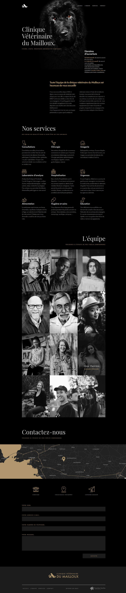

# Mailloux

## Simple HTML/CSS template

Mailloux is an HTML template for small businesses. The demo shows the site of a veterinary clinic, but the theme is applicable to any type of business or company. 

The theme is easily editable. You can quickly do whatever you want with it.

If you're interested, don't hesitate to star or fork this repo!
So, Ready, set, go! 

## Bugs and issues

Have a bug or an issue with this template? [Open a new issue](https://github.com/TimVaraillas/Mailloux/issues)

## License information

Mailloux is licensed under The MIT License (MIT). Which means that you can use, copy, modify, merge, publish, distribute, sublicense, and/or sell copies of the Software. But you always need to state that TimVaraillas is the original author of this template.